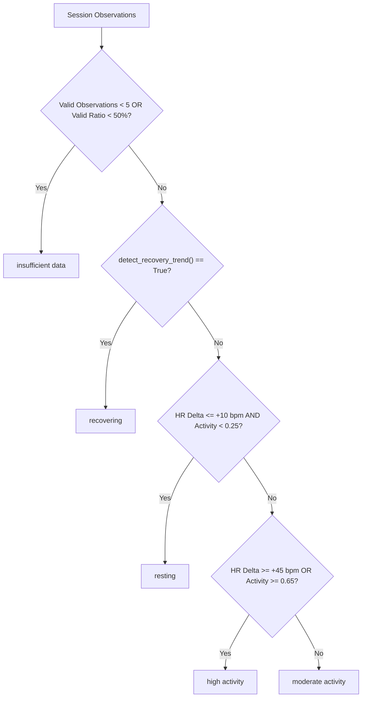

# Smart Fitness Session Analyzer

**Course:** ACT4420 - Object-Oriented Analysis Systems  
**Assignment:** Python Programming Assignment (I)  
**Selected Option:** Option A (Smart Fitness Session Analyzer)  
**Student Name:** Mehmood Hasan  
**Student Number:** 4360  

---

## 1. Project Overview

The **Smart Fitness Session Analyzer** is an object-oriented Python application designed to process, validate, and analyze biometric telemetry generated by wearable devices during fitness sessions. 

In modern workout monitoring, raw sensor streams are frequently noisy, containing dropped packets (`None` values), sensor saturation artifacts (impossible heart rate or negative activity numbers), and poor wireless signal transmission. This program ingests raw dictionary-based observation streams alongside personal resting baseline profiles, filters out invalid or unreliable data, calculates aggregate statistics and personal baseline deviations, and objectively classifies the session's cardiovascular intensity (`resting`, `moderate activity`, `high activity`, `recovering`, or `insufficient data`).

The application is written strictly with the **Python standard library** (standard modules such as `typing`, `json`, `math`, `pathlib`, `sys`, and `unittest`), deliberately avoiding third-party packages like pandas, numpy, or scikit-learn.

---

## 2. System Architecture & Class Design

The project is structured into modular components with clear separation of concerns:

```text
Assignment 1/
|-- option_a_fitness/       # Instructor-provided generator and documentation
|   |-- DATA_DESCRIPTION.md
|   |-- data_generator.py
|   `-- example_usage.py
|-- models.py               # Core domain classes (Participant, Observation, Sessions)
|-- calculations.py         # Standalone calculation, validation, and presentation functions
|-- sample_data.py          # Data loader interfacing with the scenario generator
|-- main.py                 # Application runner demonstrating all five scenarios
|-- tests.py                # Comprehensive unittest test suite (31 tests)
|-- requirements.txt        # Standard library declaration
`-- README.md               # Complete project documentation
```

### Class Responsibilities

| Class | File | Core Responsibility |
|---|---|---|
| **`Participant`** | `models.py` | Represents a person undergoing fitness monitoring. Encapsulates personal physiological reference values (`baseline_heart_rate`, `baseline_skin_response`, `baseline_temperature`) and prevents corrupt baseline entry via property setters. |
| **`Observation`** | `models.py` | Models a discrete temporal measurement window. Evaluates sensor signal reliability, checks physiological boundaries, and logs specific rejection diagnostics if corrupted. |
| **`FitnessSession`** | `models.py` | Represents an exercise session for a participant. Implements composition by coordinating a `Participant` and a collection of `Observation` objects. Computes session aggregates, runs the classification logic, and generates console/dict reports. |
| **`AdvancedFitnessSession`** | `models.py` | Subclass of `FitnessSession`. Overrides summary and classification routines to compute advanced cardiovascular strain indices (heart rate reserve utilization) and contextualize physiological workload. |

---

## 3. Object-Oriented Principles Demonstrated

### A. Encapsulation
- **Where:** `Participant` in `models.py`.
- **Implementation:** The resting baselines are stored in protected attributes (`_baseline_heart_rate`, `_baseline_skin_response`, `_baseline_temperature`).
- **Validation:** Access is mediated through `@property` getters and setters. For example, setting `baseline_heart_rate` validates that the value is numeric and within the physiological resting limits of 35–110 bpm; invalid types raise a `TypeError` and out-of-range values raise a `ValueError`. Skin response is guarded against negative numbers, and skin temperature is restricted to plausible human ranges (28–38 deg C).

### B. Composition
- **Where:** `FitnessSession` in `models.py`.
- **Implementation:** A `FitnessSession` **has-a** `Participant` instance (`self.participant`) and **has-many** `Observation` instances (`self.observations = []`). The session manages the lifecycle of its observations, filters valid from rejected records, and computes summaries across them without exposing their raw internal dictionaries.

### C. Inheritance and Method Overriding
- **Where:** `AdvancedFitnessSession` inheriting from `FitnessSession` in `models.py`.
- **Implementation:**
  - `calculate_summaries()`: Invokes `super().calculate_summaries()`, then calculates the participant's Heart Rate Reserve (Karvonen method) and appends a `cardiovascular_strain` metric dictionary.
  - `classify()`: Calls `super().classify()`, then enriches the classification reasoning with the reserve utilization percentage.
  - `to_dict()`: Extends the base dictionary with `"session_type": "AdvancedFitnessSession"`.

### D. Class Methods and Static Methods
- **Class Method:** `Observation.from_dict(cls, data: dict)` in `models.py` provides a clean factory constructor to instantiate and validate observations directly from raw dictionary feeds.
- **Static Method:** `Observation.validate_metric_range(value, lower_bound, upper_bound, metric_name)` in `models.py` is an independent utility function that validates numerical limits without requiring access to instance state.

---

## 4. Standalone Functions

To comply with the requirement for at least four standalone functions for calculation, validation, or presentation, `calculations.py` defines:

1. **`calculate_summary_statistics(values)`**  
   Computes mean, min, max, and count from numeric sequences. Gracefully handles empty sequences by returning `None` instead of causing a `ZeroDivisionError`.
2. **`detect_recovery_trend(observations)`**  
   Divides valid observations into early (first third) and late (final third) windows. Compares the average heart rate and activity level to objectively confirm whether exertion dropped significantly back toward baseline.
3. **`calculate_baseline_deviations(avg_hr, avg_temp, baseline_hr, baseline_temp)`**  
   Computes both absolute differences and percentage changes of session averages relative to the participant's resting reference values.
4. **`format_console_table(headers, rows)`**  
   A presentation helper that computes dynamic column widths and renders aligned ASCII tables for terminal output.
5. **`validate_raw_observation_dict(raw)`**  
   A validation helper verifying the structure and key presence of incoming dictionary payloads prior to object mapping.

---

## 5. Assumptions and Classification Rules

### Data Hygiene & Observation Validation
An observation is flagged as **invalid** and excluded from summary statistics if any of the following occur:
- `signal_quality` $< 0.60$ or is `None`: Sensor noise makes values unreliable.
- `heart_rate` is `None` or outside $[35, 205]$ bpm.
- `skin_response` is `None` or $< 0$.
- `temperature` is `None` or outside $[25.0, 42.0]$ deg C.
- `activity_level` is `None` or outside $[0.0, 1.0]$.

### Classification Decision Rules
The classification algorithm evaluates the session in order of physiological precedence:



1. **`insufficient data`**: Fewer than 5 valid observations exist, or less than 50% of the recorded windows are usable.
2. **`recovering`**: Heart rate and activity start elevated in the first third of the session and drop significantly (heart rate drop $\ge 15.0$ bpm and activity drop $\ge 0.20$) in the final third.
3. **`resting`**: Average heart rate elevation is $\le 10.0$ bpm above baseline, and average activity level is $< 0.25$.
4. **`high activity`**: Average heart rate elevation is $\ge 45.0$ bpm above baseline, or average activity level is $\ge 0.65$.
5. **`moderate activity`**: Intermediate elevation between resting and high intensity.

---

## 6. Installation and Running Instructions

### Prerequisites
- Python 3.10 or higher (tested with Python 3.13).
- Standard library only; no external package installation is needed.

### Running the Application

1. Clone the repository:
   ```bash
   git clone https://github.com/USERNAME/REPOSITORY.git
   cd REPOSITORY
   ```

2. Run the main demonstration script:
   ```bash
   # On Windows:
   python main.py

   # On macOS/Linux:
   python3 main.py
   ```

3. Run the automated test suite:
   ```bash
   # On Windows:
   python -m unittest tests.py -v

   # On macOS/Linux:
   python3 -m unittest tests.py -v
   ```

---

## 7. Example Output

### Console Session Report Sample

Below is a truncated excerpt from `python main.py` showing the report output for Scenario 2 (Moderate Activity):

```text
========================================================================
 FITNESS SESSION REPORT: MODERATE CARDIO SESSION
========================================================================
Participant ID       : P-MOD-02
Personal Baselines   : HR 82 bpm | Temp 32.3 deg C | Skin 1.58
------------------------------------------------------------------------
SESSION CLASSIFICATION: MODERATE ACTIVITY
Reason: Average heart rate was 113.0 bpm (+31.0 bpm from baseline) and activity averaged 0.51, indicating moderate workout intensity.
------------------------------------------------------------------------
Observations Overview: 12 usable out of 12 total (100.0% valid)

Summary Statistics (Usable Data Only):
+---------------------+-------+-------+-------+--------------------+
| Metric              | Mean  | Min   | Max   | vs Baseline        |
+---------------------+-------+-------+-------+--------------------+
| Heart Rate (bpm)    | 113.0 | 107.0 | 122.0 | +31.0 bpm (+37.8%) |
| Activity (0-1)      |  0.51 |  0.41 |  0.63 | N/A                |
| Temperature (deg C) | 32.49 | 32.29 | 32.65 | +0.19 deg C        |
+---------------------+-------+-------+-------+--------------------+
========================================================================
```

### Sensor Rejection Sample (Scenario 5)

When sensor faults occur, invalid observations are quarantined and reported with clear diagnostics:

```text
Rejected Sensor Observations (12 flagged):
+-----------+------------+----------+-------------+---------------------------------------------------------------------------------------------------------------------------+
| Timestamp | Heart Rate | Activity | Signal Qual | Rejection Reasons                                                                                                         |
+-----------+------------+----------+-------------+---------------------------------------------------------------------------------------------------------------------------+
|         0 | None       |     0.48 |        0.46 | Signal quality 0.46 is below reliability threshold (0.60); Missing value for heart_rate                                   |
|         1 |        265 |     0.54 |         0.5 | Signal quality 0.50 is below reliability threshold (0.60); heart_rate value 265 is out of allowable range [35, 205]       |
|         2 |         71 |     -0.2 |        0.11 | Signal quality 0.11 is below reliability threshold (0.60); activity_level value -0.2 is out of allowable range [0.0, 1.0] |
+-----------+------------+----------+-------------+---------------------------------------------------------------------------------------------------------------------------+
```

### Structured Dictionary Return Sample

Calling `session.to_dict()` produces structured data suitable for API export or automated storage:

```json
{
  "session_name": "Resting Session",
  "participant_id": "P-REST-01",
  "classification": "resting",
  "explanation": "Average heart rate was 77.92 bpm (+1.9 bpm from baseline) with minimal activity (0.12), consistent with rest.",
  "heart_rate_summary": {
    "mean": 77.92,
    "min": 75.0,
    "max": 81.0,
    "count": 12
  },
  "usable_percentage": 100.0
}
```

---

## 8. Known Limitations & Future Improvements

1. **Fixed Window Slicing for Recovery:**  
   The `detect_recovery_trend()` function currently splits observations into thirds. For longer sessions with intermittent recovery (e.g. interval training), an exponential moving average or rolling slope would better capture localized recovery intervals.
2. **Static Maximal Heart Rate Estimation:**  
   `AdvancedFitnessSession` uses a default maximal heart rate ceiling of 195 bpm. In a production system, participant age, biological sex, and VO2-max test records should be stored in `Participant` to calculate individual heart rate reserves accurately.
3. **No Sensor Interpolation:**  
   Currently, any window with missing or corrupted fields is fully discarded. For isolated missing points in real-world deployments, brief linear interpolation across neighboring timestamps could rescue windows with high overall signal quality.

